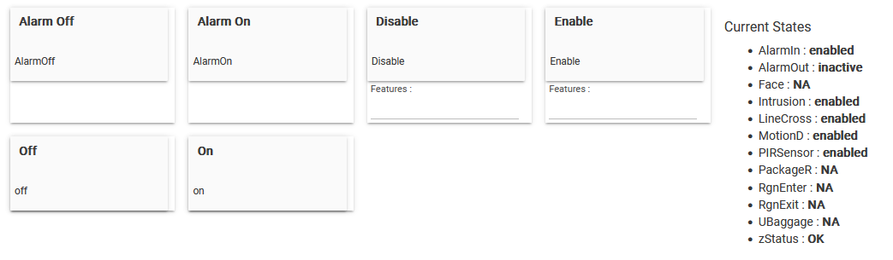
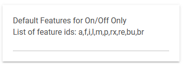
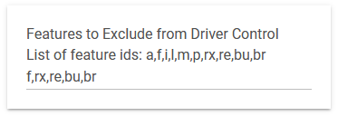

# Hikvision Camera Controller for Hubitat Elevation
# User Guide - R1.0 - Work In Progress
**Copyright:** 2024 Thomas R Schmidt, Wildwood IL   
Unauthorized copy or publication is prohibited.
## Prerequisites
To use the key feature of this driver, which is to trigger Alarm Input Events on your camera using sensors and rules in HE, your camera must have wired Alarm I/O ports that are accessible and not in use. Because for this to work, you will need to connect the In/Out ports with a jumper wire. This will not damage your camera. It is required since the driver is only allowed to trigger Alarm Out when using the Hikvision API. The API does not not allow apps to trigger Alarm In. 

When Alarm Out is triggered, the camera switches a dry contact relay on the ouput port from open to closed, nothing else. This exposes a closed circuit over the jumper wire to the Alarm In port and its relay, which is all it is waiting for in its NO state. When it senses a closed circuit, the Alarm In relay closes and the event fires. When the Alarm is cleared, the output relay opens and so does the circuit to Alarm In, which then goes back to its NO state. There is no voltage applied. Voltage is only present when there is a powered sensor (input), powered siren (output) or powered security system control panel connected. The reason you don't need to connect the grounding ports is because both relays share the same path to ground in the camera.

You can and should first read the Disclaimers below and then test this yourself by connecting the ports, enabling and arming your Alarm Input and Output Events, and then triggering a manual alarm from the Alarm Out event on your camera (don't forget to clear it).

If you can't use the Trigger feature, you can still use the driver to control the arming schedules for all motion detection features, allowing you to arm your cameras based on your mode in HE.
The driver also requires specific camera settings, which are described below.
## Introduction
This driver implements the Actuator and Switch capabilities. Its commands allow you to perform the following functions:
* Trigger Alarm Input Events using HE Sensors and Rules
* Enable/Disable Alarm Input Handling
* Enable/Disable Motion Detection Features
* Enable/Disable all Motion Detection Features with a single On/Off or Enable/Disable command, filtering those features you don't use or wish to leave alone. Thus simplifying the rules needed to arm and disarm your cameras and allowing for integration with HSM. Your cameras will appear in the list of lights you can turn on/off when arming/disarming.

## Camera Configuration
To use the driver, your camera must be configured as follows. It is recommended that you login to the camera directly to make these changes. Do not use the NVR web interface unless you can convert these steps into their equivalent on the NVR. The steps outlined below are for a direct connection only. Please note that the path to the setting on your camera may be different.
 
1: System > Security > **Web Authentication = digest/basic**
 
2: Network > Advanced > Integration Protocol > **Hikvision-CGI Enabled, Authentication=digest/basic**
 
3: System > User Management > Optional **Operator** account with the **Remote Parameters/Settings and Remote Notify** options selected.   
You can use your admin account, but it is **strongly recommended** that you create an Operator account for Hubitat. Do not take chances with your Hikvision admin accounts.
 
4: **Basic and Smart Events must not be configured to trigger Alarm Out**   
Check Linkage Methods for all Basic and Smart Events to make sure this option is not selected. HE is now in control.   
 
5: **Basic Events > Alarm Input**   
Set Alarm Type to NO (is default, normally open)   
Set Arming Schedule to 24x7    
Set optional Alarm Name   
Set desired Linkage Methods (email, notify, record)

6: **Basic Events > Alarm Output**    
Set Arming Schedule to 24x7   
Set optional Alarm Name   
Set Delay to 5 seconds (default)

7: **Storage > Schedule Settings**   
Click Advanced button and set appropriate Pre-Record time to accomodate for the factors unique to your environment, including the sensors and rules you will be using to trigger alarms and recording.
 
8: **Jumper Wire**   
Connect the Alarm In/Out ports with a small jumper wire. Thin solid wire works best (e.g. telephone wire). Stranded wired can be difficult to insert into these ports. The ports will be marked I, O, In, Out, G, or Gnd. **You may need a magnifying glass. Connect only the ports marked I/O or In/Out.** If your camera has more than one pigtail for Alarm I/O, only one of them needs to be connected, unless you have a high-end camera with multiple Alarm I/O ports (like some NVRs).

**NVR Configuration**   
The Virtual Host feature must be enabled and tested (i.e. you can connect your browser to the camera directly using the URL provided by the NVR in Camera Management)

You are now ready to configure your camera for operation with HE using the Hikvision Camera Controller.
 
## Device Configuration and Operation
1. Add a new Virtual Device using the Hikvision Camera Controller
2. Enter IP Address, Port, Credentials and Camera Name (as defined on the Camera).

For cameras connected to the NVR POE subnet, use the ip address of the NVR and the Port assigned by the Virtual Host feature. For all other cameras, use the camera ip address and port. Do NOT use the NVR to access a local network camera you have added to the NVR for recording and control purposes.

4. Now is the time to learn about the filters you will be using to specify which features you want to control (enable/disable) when running the drivers commands. The filter is a string of lower case letters where each unique letter or pair of letters identifies the feature:
* a = Alarm Input Handling
* i = Intrusion
* l = Line Crossing
* m = Motion Detection
* p = PIR Sensor
* re = Region Enter
* rx = Region Exit
* bu = Unattended Baggage
* br = Baggage/Package Removal
* When entering filter strings, formatting and order are not important. Extraneous characters are ignored. Commas improve readability here but aren't needed.

5. Enter the filter to be applied when running the On/Off commands. If no filter is specified, "all available motion detection features" will be enabled or disabled when these commands are run. Leave blank for starters. Note: Alarm Input Handling is not included by default when enabling/disabling "all available" since it is not a motion detection feature and serves a different purpose.
 

7. Enter the filter to exclude features you don't use and those your camera does not have. For example, if you don't use the Face Detection feature, include "f" in this filter to prevent the driver from changing its state when switching "all available". If you leave this filter blank and Save Preferences, the driver will attempt to get status for all of its supported features from your camera. If the URL Path to the feature on your camera was "not found", a benign error will be logged and the feature state will be set to "NA", same as entering the filter here does, without the lookup and HTTP GET error.  For starters, leave this filter empty and let the driver see what it can find. Then come back and filter those you don't use, and those it didn't find so next time you save, it doesn't go through the trouble. Check the logs after you save.

7. Click Save.

Every time you Save Preferences, the driver will validate your camera by performing these tests:
1. Ping the ip address to see if it is online.
2. If online, send a GET request to **http://ipaddress:port/ISAPI/System/deviceInfo** using the Credentials you entered. (Tip: This is something you can do yourself in a browser window. The browser will prompt you for your credentials. You can do the same with all of the GET PATHS you see in the log.)
3. If ok, compare the camera name on the camera with the name you entered.

When these checks fail, zStatus will display an error message. If you can't get past this step, please call the help desk to report that you have a Hikvision camera that is not being recognized (see below).
 
When all is well, zStatus will say Yay! Your camera has been validated and is ready for operation. Check the log to see what it reported back on.
 
If a motion detection feature is not available on your camera and was not exluded by the driver control filter, its status will be set to NA.
 
You may now start running commands and create test rules to validate its operation.

Start with turning your motion detection features On/Off and watch the change in state. Check the log to see the results. Check Events, too. State changes will be posted immediately using sendEvent but there may be queuing delays in HE.

Test the Enable/Disable commands with and without filters and confirm the state changes. Check the log to see the results.

Enable Alarm Input Handling using the Enable command with the filter "a" and then turn the Alarm On to confirm you receive the notifications you have configured for the event. If you have a camera with a siren, check that option under Linkage Methods to see how fast the trigger is.

IMPORTANT: Do not forget to turn the Alarm OFF in your rules when conditions go back to normal. If you have a rule with (conditions=true) that turns it on, you need a second rule with (conditions=false) to turn it off. Forgetting to turn off the alarm will eventully lead the camera to send out notifications every minute that the alarm is active. Not all cameras will behave the same. **Do not forget to turn the lights off.**

Note: By design, the Alarm Input Handling event is NOT included by default when running On/Off or Enable/Disable commands with no filter (i.e. switch "all available"). You need to control the enabled/disabled state of that event separately.

### In Summary
This driver gives you the flexibility to trigger your cameras with more reliable and consistent PIR sensors, or any other sensor. For example, when you're away and your house is armed, you can trigger all of your cameras if any one of your security sensors goes off.

You are now in complete control of when Alarms can be triggered and when Motion Detection features are enabled. 
## State Changes During Operation
The status attributes change when a command is run that triggers it. The driver always gets the current state from the camera first, to determine if a change in state is actually needed, and then updates the status attribute to the new state, as needed, using sendEvent.

During normal operation, zStatus should remain OK at all times. All commands ping the ip first to see if it is online. If the ping fails, zStatus will go to OFF and remain OFF until a command is run that sees it back online.
 
Note: The Alarm In State of the wired port will not change to active/inactive on screen when Alarm Out is triggered or cleared. The only command that updates Alarm In state is Get Status, and when Saving Preferences. Use Get Status while testing to confirm the requested state change.

If you change the credentials of the hubitat account on the camera and forget to change them here, the next time a command is run, zStatus will be set to CRED and operation suspended until you Save Preferences to fix the mis-match.
 
If any unexpected HTTP GET/PUT errors occur, zStatus will go to ERR and operation suspended until the problem is resolved and Save Preferences is run. These errors may require a call to the help desk.
## Errors and Troubleshooting
The driver logs all of its activity and catches all errors from the HTTP GET/PUT methods but does not catch Groovy/Java script errors involving bad data.
 
If the driver stops working, check the logs and call the help desk.
 
Debug logging is used for dumping the raw or converted to GPath XML data that is returned by the camera in response to a GET request. This will aid in determining where the data has gone bad when unexpected java/groovy script errors occur.
## Supported Cameras and NVRs
work in progress
## Security Warning
This driver uses HTTP Basic Authentication to login to your camera. Your encoded credentials are saved and displayed in the Data section of the device in the format required for this method of authentication.
## Help Desk - Contact for Support
Please message me @TomS on the Hubitat Community Forum, not on github. I do look forward to hearing your feedback.
Thanks for checking this out.
## Disclaimers
Hubitat Elevation, which this driver is a component of, is not a security system and should not be relied on as one.

With regards to the Alarm I/O ports: Hard-wired security systems are complex and may be difficult to understand for those with little or no experience in electrical theory and application. The method used to jump the I/O ports was first obtained in 2018 from a knowledgeable security systems professional on the IpCamTalk Forum when I was integrating my new cameras with Vera. Prior to publishing this User Guide, I confirmed the existence and operation of the internal dry contact relays on the Alarm I/O ports of Hikvision devices using Hikvision documentation. The description presented herein is based on my personal knowledge of electrical theory and application and my best effort at obtaining factual and accurate information on the operation of the Alarm I/O ports. Thus, the description presented herein should not be taken as completely accurate or factual.

USE AT YOUR OWN RISK

And have a wonderful day! :)
