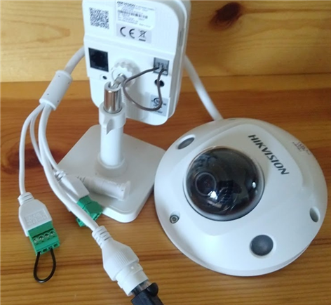
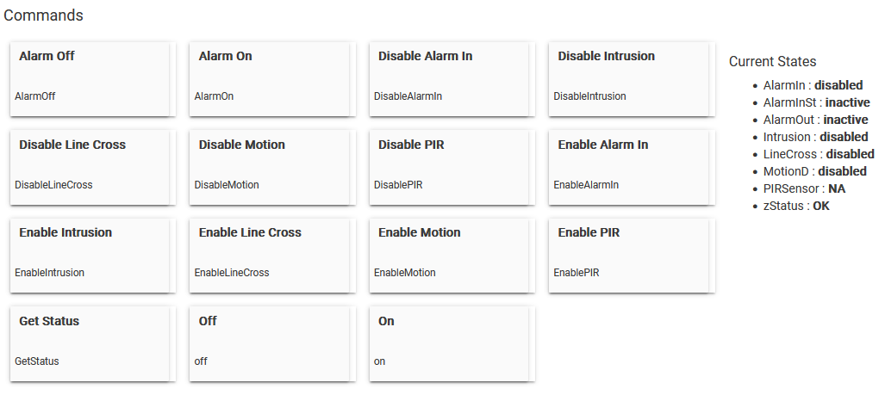

# Hikvision Camera Controller for Hubitat Elevation
# User Guide - R1.0
**Copyright:** 2024 Thomas R Schmidt, Wildwood IL   
Unauthorized copy or publication is prohibited.
## Prerequisites
Your cameras must be on a switch that is connected to your router and configured with a static ip address. The driver is unable to control or trigger cameras that are directly connected to a Hikvision NVR. This functionality is planned for a future release.

To use the key feature of this driver, which is to trigger Alarm Input Events on your camera using sensors and rules in HE, your camera must have wired Alarm I/O ports that are accessible and not in use. Because for this to work, you will need to connect the In/Out ports with a jumper wire. This will not damage your camera. It is required since the driver is only allowed to trigger Alarm Out when using the Hikvision API. The API does not not allow apps to trigger Alarm In. 

When Alarm Out is triggered, the camera switches a dry contact relay on the ouput port from open to closed. This exposes a closed circuit over the jumper wire to the Alarm In port and its relay, which is all it is waiting for in its NO state. When it senses a closed circuit, the relay closes and the event fires. When the Alarm is cleared, the output relay opens and so does the circuit to Alarm In, opening its relay. There is no voltage applied. Voltage is only present when there is a powered sensor (input), siren (output) or security system control panel connected. The reason you don't need to connect the Grounding ports is because both relays share the same path to ground in the camera.

You can and should test this yourself first by connecting the ports, enabling your Alarm Input Event and triggering a manual alarm from the Alarm Out event on your camera (don't forget to clear it).

If you can't use the Trigger feature, you can still use the driver to control the arming schedules for all motion detection features, allowing you to arm your cameras based on your mode in HE.
The driver also requires specific camera settings, which are described below.
## Introduction
The driver implements the Actuator capability and allows you perform the following functions by calling the drivers custom commands from your rules and apps.
* Trigger Alarm Input Events using HE Sensor Devices and Rules
* Enable/Disable Alarm Input Handling
* Enable/Disable Motion Detection Features
* Maintain Arming Schedules in HE based on mode
* Does not integrate with HSM at this time

   
This allows you to trigger alarms on your cameras whenever conditions warrant and use HE to control the arming schedule for the Alarm Input Event and all supported Motion Detection Events in HE, based on changes in mode (home, away, day, night). You can do this by setting the arming schedules on the camera to 24x7 and then running the driver commands to enable/disable motion detection features when the change in mode occurs.

### Additional Features Coming Soon in R1.1
Since I am a new developer on HE, I will be releasing additional features within a week or two after this release to both test and learn how to use the Hubitat Package Manager upgrade process, as both developer and user. If you happen to be reading this, you may want to hold off until R1.1 is available since these new features are key:
* Switch Capability to Enable (on) or Disable (off) all Motion Detection Features with a single command. This also provides integration with HSM. Your cameras will appear in the list of lights you can turn on/off when arming/disarming.
* New setting in Preferences to specify which Motion Detection features you are not using in order to exclude them from the On/Off commands and prevent their Enable/Disable commands from being run.
## Camera Configuration
To use the driver, your camera must be configured as follows:
Please note that the path to the setting on your camera may be different.
 
1: System > Security > Web Authentication = digest/basic
 
2: Network > Advanced > Integration Protocol >
   Hikvision-CGI Enabled, Authentication=digest/basic
 
3: Optional Operator account with the Remote Parameters/Settings and Remote Notify options selected.   
You can use your admin account, but it is recommended that you create an Operator account for Hubitat.
 
4: Basic and Smart Events must not be configured to trigger Alarm Out.   
Check Linkage Methods for all Basic and Smart Events to make sure this option is not selected. HE is now in control.   
 
5: Enable Alarm Input Handling in Basic Events > Alarm Input   
Set Alarm Type to NO (is default, normally open, no voltage)   
Set the Alarm Name (e.g. CamName Alarm)   
Set the Arming Schedule to 24x7    
Set desired Linkage Methods (email, notify, record)

6: In Basic Events > Alarm Output, set Delay to 5 seconds (default)

7: In Storage > Schedule Settings: Click Advanced button and set appropriate Pre-Record time to accomodate for the delay and other factors unique to your environment, including the sensors and rules you will be using to trigger alarms and recording.
 
8: Connect the Alarm In/Out ports with a small jumper wire. Thin solid wire works best (e.g. telephone wire). Stranded wired can be difficult to insert and cause short circuits across the ports.

You are now ready to configure your camera for operation with HE using the Hikvision Camera Controller.
 
## Device Configuration and Operation
1: Add a new Virtual Device using the Hikvision Camera Controller

2: Enter your camera ip address, port and credentials in userid:password format. Click Save.
 
Whenever you Save Preferences, the driver will validate your camera by first pinging the ip address and then sending a GET request for the data from /System/deviceInfo using the Credentials you entered. If these checks fail, an error message will be displayed in the zStatus attribute and you will need fix it and try again. If you can't get past this step, you may need to call the help desk to report that you have a Hikvision camera that is not being recognized.
 
If all is well, it will say Yay!. Your camera has been validated and is ready for operation.
 
If a motion detection feature is not available on your camera, its status will be set to NA and the on/off commands for that feature will be disabled.
 
You may now start running commands and create test rules to validate its operation.

Start with turning your motion sensors on/off and watch the change in state. Confirm the change in state on your camera.

Enable the Alarm Input Event and turn the Alarm On to confirm you receive the notifications you have configured for the event. If you have a camera with a siren, check that option under Linkage Methods to see how fast the trigger is, considering the Delay you have configured for the Alarm Out Event.

Do not forget to turn the Alarm OFF in your rules when conditions go back to normal. If you have a rule with (conditions=true) that turns it on, you need a second rule with (conditions=false) to turn it off.

The Get Status command (not shown in the image above) will get the current state of all features from the camera and update the status attributes on the device, if needed. This command is there for you to confirm state changes as you develop your rules for implementation. It is also the only command that will refresh the current state of the Alarm Input port. Do not call Get Status from any rules.
### In Summary
This driver gives you the flexibility to trigger your cameras with more reliable and consistent PIR sensors, or any other sensor. For example, when you're away and your house is armed, you can trigger all of your cameras if any one of your security sensors goes off.

You are now in complete control of when Alarms can be triggered and when Motion Detection features are enabled. 
## State Changes During Operation
The status attributes change when a command is run that triggers it. The driver always gets the current state from the camera first, to determine if a change in state is actually needed, and then updates the status attribute to the new state, as needed, using sendEvent.

During normal operation, zStatus should remain OK at all times. All commands ping the ip first to see if it is online. If the ping fails, zStatus will go to OFF and remain OFF until a command is run that sees it back online.
 
Note: The Alarm In State of the wired port will not change to active/inactive on screen when Alarm Out is triggered or cleared. The only command that updates Alarm In state is Get Status, and when Saving Preferences. Use Get Status while testing to confirm the requested state change.

If you change the credentials of the hubitat account on the camera and forget to change them here, the next time a command is run, zStatus will be set to CRED and operation suspended until you Save Preferences to fix the mis-match.
 
If any unexpected HTTP GET/PUT errors occur, zStatus will go to ERR and operation suspended until the problem is resolved and Save Preferences is run. These errors may require a call to the help desk.
## Errors and Troubleshooting
The driver logs all of its activity and catches all errors from the HTTP GET/PUT methods but does not catch Groovy/Java script errors involving bad data.
 
If the driver stops working, check the logs and call the help desk.
 
Debug logging is used for dumping the raw or converted to GPath XML data that is returned by the camera in response to a GET request. This will aid in determining where the data has gone bad when unexpected java/groovy script errors occur.
## Security Warning
This driver uses HTTP Basic Authentication to login to your camera. Your encoded credentials are saved and displayed in the Data section of the device in the format required for this method of authentication.
## Help Desk - Contact for Support
Please message me through the Hubitat Community Forum, not on github. I do look forward to hearing your feedback.
Thanks for checking this out.
## Disclaimers
Hubitat Elevation, which this driver is a component of, is not a security system and should not be relied on as one.

With regards to the Alarm I/O ports: Hard-wired security systems are complex and may be difficult to understand for those with little or no experience in electrical theory and application. The method used to jump the I/O ports was first obtained in 2018 from a knowledgeable security systems professional on the IpCamTalk Forum when I was integrating my new cameras with Vera. Prior to publishing this User Guide, I confirmed the existence and operation of the internal dry contact relays on the Alarm I/O ports of Hikvision devices using Hikvision documentation. The description presented herein is based on my personal knowledge of electrical theory and application and my best effort at obtaining factual and accurate information on the operation of the Alarm I/O ports. Thus, the description presented herein should not be taken as completely accurate or factual.

USE AT YOUR OWN RISK

And have a wonderful day! :)
